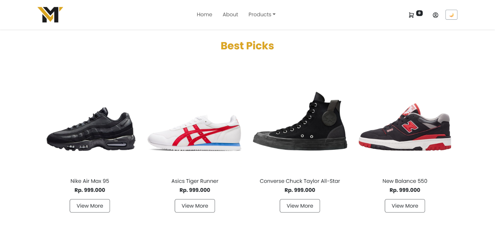

# Mova

Mova is an e-commerce landing site for sneakers, built as a school assignment
with Bootstrap 5 and JavaScript libraries.

**Live demo:** https://achdniel.github.io/Mova/



## Features
- Responsive layout (mobile, tablet, desktop)
- Product carousel (OwlCarousel) and scroll animations (AOS)
- Product listing with search, brand filter, sorting, and pagination
- Product detail page, login / register / payment pages (UI only)

## Tech stack
HTML5, CSS3, Bootstrap 5, JavaScript, OwlCarousel, AOS

## Project structure
```
Mova/
├── assets/
│   ├── css/style.css
│   ├── js/
│   ├── img/
│   └── data/products.json
├── index.html
├── products.html
├── product-detail.html
├── about.html
├── login.html / register.html / payment.html
└── README.md
```

## Run locally
```
git clone https://github.com/achdniel/Mova.git
cd Mova
```
Open with the VS Code **Live Server** extension (needed because the site loads
`products.json` with `fetch`).

## Notes
Login, register, and payment are demo interfaces only. No real data is stored
or processed.

## License
MIT
